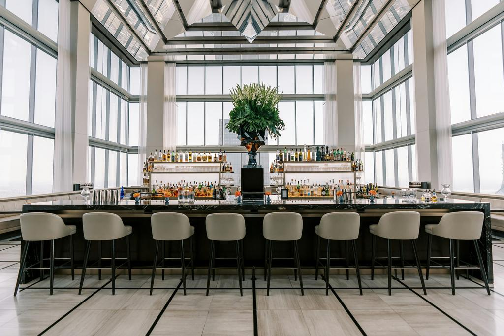

# Introduction to Capstone Project - 2
## Made with 💝 for Christel House Students 😊

## Download boiler plate
On your dev environment, use following command or [click here](https://static.sibansal.dev/ch_cp2.zip) to download assets directly:
```
wget static.sibansal.dev/ch_cp2.zip
```

To unzip assets, use:
```
unzip ch_cp2.zip
```

## Download assets
On your dev environment, use following command or [click here](https://static.sibansal.dev/ch_webdev_capstone_project_assets.zip) to download assets directly:
```
wget static.sibansal.dev/ch_webdev_capstone_project_assets.zip
```

To unzip assets, use:
```
unzip ch_webdev_capstone_project_assets.zip
```

## Test Server Commands
Start Server:
```
npx http-server .
```

Stop Server:
```
CTRL + C
```
## Updated Sections

### Achievement Section

#### Markup
```
        <section id="Achievements">
            <h2>Achievements</h2>
            <div class="container">
                <div>
                    
                </div>
                <div>
                    <ul>
                        <li><span>Science Fair Success:</span> I won a science fair with my innovative project.</li>
                        <li><span>Research Publication:</span> I have won the opportunity to publish my research
                            findings in a scientific journal.</li>
                        <li><span>Academic Excellence:</span> I have won the distinction of maintaining a perfect
                            GPA in science subjects.</li>
                        <li><span>National Science Olympiad:</span> I won a medal in a national science Olympiad,
                            showcasing my knowledge and skills.</li>
                        <li><span>STEM Competition:</span> I won accolades in STEM competitions, demonstrating my
                            prowess in science, technology, engineering, and mathematics.</li>
                        <li><span>Prestigious Internship:</span> I secured a prestigious science internship, winning
                            the opportunity to gain valuable hands-on experience.</li>
                        <li><span>Scholarship Recipient:</span> I won a scholarship for my outstanding academic
                            achievements in science and technology-related fields.</li>
                        <li><span>Leadership Role:</span> I won the chance to serve as a leader in a science club,
                            organizing events and projects.</li>
                        <li><span>AP Exam Success:</span> I won recognition for achieving top scores on Advanced
                            Placement (AP) exams in various science subjects.</li>
                        <li><span>College Acceptance:</span> I won admission into a top-tier university for a
                            science major, setting the stage for my future academic and career success.</li>
                    </ul>
                </div>
            </div>
        </section>
```

#### Styling
```
#Achievements .container
{
    display: flex;
    flex-wrap: nowrap;
    justify-content: space-evenly;
}

#Achievements .container div:last-child
{
    width: 50%;
}
```

### Gallery Section

#### Markup
```
        <section id="Gallery">
            <h2>Gallery</h2>
            <div class="container">
                
                
                
                
                
                
                
                
            </div>
        </section>
```

#### Styling
```
#Gallery
{
    padding-bottom: 0;
}

#Gallery .container
{
    display: grid;
    grid-template-rows: 1fr 1fr 1fr;
    grid-template-columns: 1fr 1fr 1fr;
    grid-gap: 0;
}

#Gallery .container img
{
    filter: grayscale(100);
    width: 100%;
    aspect-ratio: 1/1;
    transition: all 2s;
}

#Gallery .container img:first-child
{
    grid-row: span 2;
    aspect-ratio: 1/2;
}

#Gallery .container img:hover
{
    filter: none;
    cursor: pointer;
}

#Gallery .container img:active
{
    transform: scale(1.2);
    z-index: 1;
    border: 2px solid burlywood;
}
```